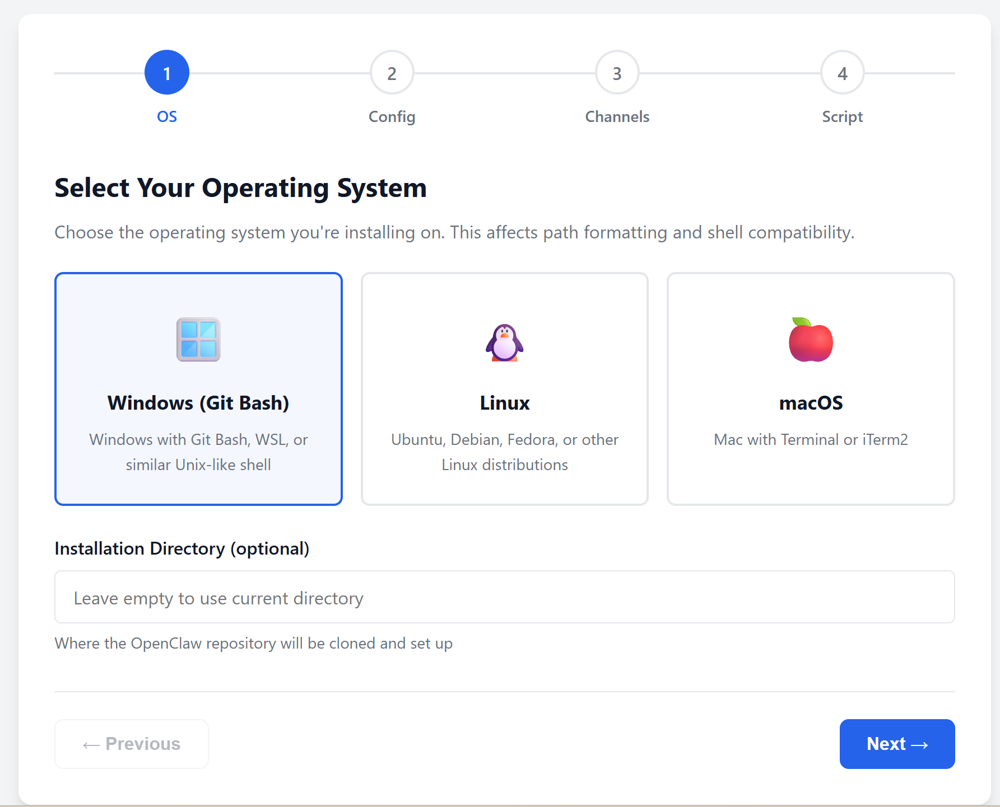
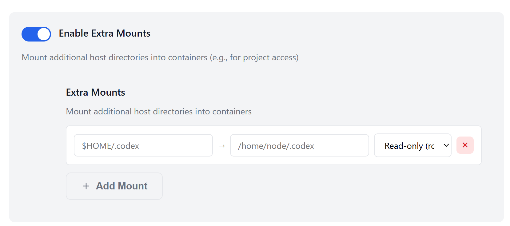
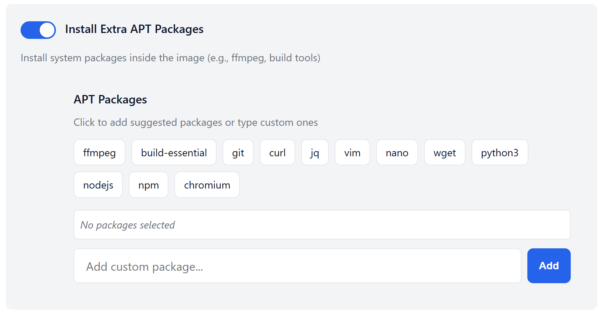
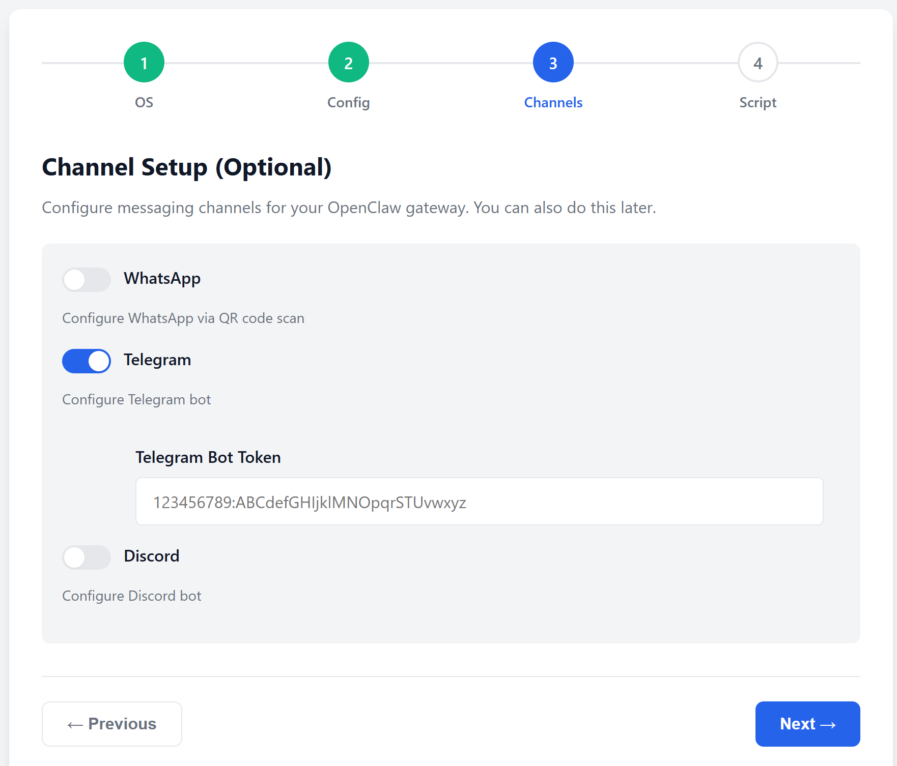
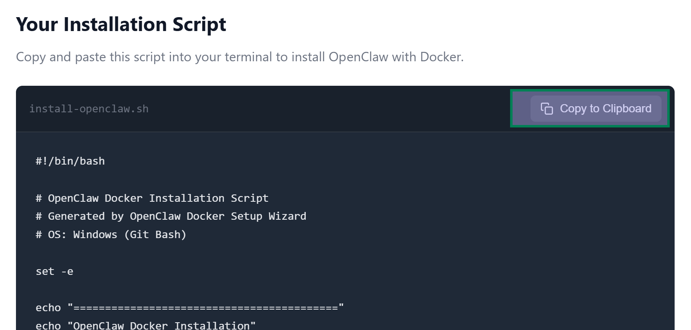

# 🐳 OpenClaw Docker Helper

> **The easiest way to install OpenClaw with Docker** — Generate custom bash scripts in seconds, no manual configuration required.

[](LICENSE)
[](https://docs.openclaw.ai/install/docker)
[](.)

## ✨ What is OpenClaw Docker Helper?

Setting up [OpenClaw](https://openclaw.ai) with Docker shouldn't require reading through endless documentation or manually typing complex bash commands. **OpenClaw Docker Helper** is a beautiful, interactive web wizard that generates copy-pasteable installation scripts tailored to your specific needs.

**No more guessing. No more typos. Just click, configure, copy, and run.**

## 🚀 Features

- 🎨 **Beautiful Interactive UI** — Step-by-step wizard with a modern, responsive design
- 🖥️ **Multi-Platform Support** — Works on Windows (Git Bash), Linux, and macOS
- ⚙️ **Smart Configuration** — Automatically detects your OS and suggests optimal settings
- 📁 **Extra Mounts Manager** — Easily add host directory mounts with a visual row-based interface
- 📦 **Package Selector** — Pick from suggested APT packages or add custom ones with a click
- 💾 **Persistent Storage** — Configure named volumes to persist data across container restarts
- 🔧 **ClawDock Integration** — Optionally install shell helpers for easier Docker management
- 🔐 **Channel Setup** — Configure WhatsApp, Telegram, and Discord bots directly from the wizard
- 📋 **One-Click Copy** — Copy your complete installation script with a single click

## 🎯 Why Use This?

| Traditional Setup | OpenClaw Docker Helper |
|------------------|------------------------|
| Read lengthy documentation | Answer a few simple questions |
| Manually type commands | Copy-paste generated script |
| Risk of typos and errors | Guaranteed correct syntax |
| No customization guidance | Smart defaults and suggestions |
| 15-30 minutes | **Under 2 minutes** |

## 🛠️ Installation

No installation needed! Just download and open:

```bash
# Clone the repository
git clone https://github.com/yourusername/openclaw-docker-helper.git

# Open in your browser
open index.html
```

Or simply double-click `index.html` after downloading.

## 📖 How It Works

### 1️⃣ Select Your OS
Choose your platform and optionally specify an installation directory. We auto-detect your OS for you!

### 2️⃣ Configure Docker Settings
Customize your setup with smart toggles:
- **Extra Mounts** — Visually add host directory mappings
- **Persistent Storage** — Keep your data safe across container restarts
- **APT Packages** — Click to add popular packages like ffmpeg, git, curl, and more
- **ClawDock Helpers** — Get convenient shell commands for daily management
- **Sandbox Image** — Build an isolated environment for secure tool execution

### 3️⃣ Setup Channels (Optional)
Configure messaging channels for your gateway:
- WhatsApp (QR code scan)
- Telegram (bot token)
- Discord (bot token)

### 4️⃣ Copy & Run
Your personalized bash script is generated instantly. Copy it and paste into your terminal. That's it!

## 🖼️ Preview









## 💻 One-click Copy of Install Script



## 🎨 Customization Options

### Extra Mounts
Mount additional directories from your host into containers:
- **Host Path**: Where on your computer (e.g., `$HOME/projects`)
- **Container Path**: Where inside the container (e.g., `/home/node/projects`)
- **Access Mode**: Read-only (ro) or Read-write (rw)

### APT Packages
Install system packages inside the Docker image:
- **Media**: `ffmpeg` — Video/audio processing
- **Development**: `build-essential`, `git`, `curl`, `jq` — Build tools and utilities
- **Editors**: `vim`, `nano` — Text editors
- **Languages**: `python3`, `nodejs`, `npm` — Programming runtimes
- **Browsers**: `chromium` — For web automation

### Channel Configuration
Set up messaging platform integration:
- **WhatsApp**: Scan QR code to pair
- **Telegram**: Enter bot token from @BotFather
- **Discord**: Enter bot token from Discord Developer Portal

## 🔧 System Requirements

- **Docker Desktop** (or Docker Engine) + Docker Compose v2
- **Git** for cloning the repository
- A modern web browser (Chrome, Firefox, Safari, Edge)
- **(Optional)** Bash shell (Git Bash on Windows)

## 🌐 Supported Platforms

| Platform | Status | Notes |
|----------|--------|-------|
| Windows (Git Bash) | ✅ Supported | Use Git Bash, WSL, or PowerShell |
| Linux | ✅ Supported | Ubuntu, Debian, Fedora, etc. |
| macOS | ✅ Supported | Intel & Apple Silicon |

## 🤝 Contributing

Contributions are welcome! Here's how you can help:

1. **Report Bugs** — Found an issue? [Open an issue](../../issues)
2. **Suggest Features** — Have an idea? [Share it](../../issues)
3. **Submit PRs** — Fix bugs or add features

### Development Setup

```bash
# Fork and clone
git clone https://github.com/yourusername/openclaw-docker-helper.git
cd openclaw-docker-helper

# No build step needed! Just open index.html
# For development, serve with a local server:
python -m http.server 8000
# or
npx serve .
```

## 📚 Resources

- [OpenClaw Documentation](https://docs.openclaw.ai/install/docker)
- [OpenClaw GitHub](https://github.com/openclaw/openclaw)
- [Docker Setup Guide](https://docs.openclaw.ai/install/docker#quick-start)
- [ClawDock Helpers](https://github.com/openclaw/openclaw/blob/main/scripts/shell-helpers/README.md)

## 📝 License

This project is licensed under the MIT License - see the [LICENSE](LICENSE) file for details.

## 🙏 Acknowledgments

- Built for the [OpenClaw](https://openclaw.ai) community
- Inspired by the need for simpler Docker onboarding
- Thanks to all contributors and testers

---

<div align="center">

**Made with ❤️ for the OpenClaw community**

[Get Started →](index.html)

</div>
